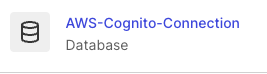
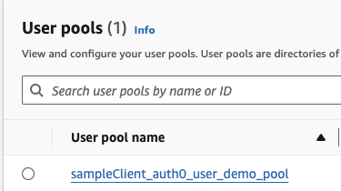

# Terraform Auth0 Create Custom DB with AWS Cognito

[This is still a WIP project and under development]
This projects creates the following resources.

 1. Cognito Database in your AWS environment
 2. Auth0 Custom Database connections with the following methods enabled
    * Get User
    * Login

## Disclaimer :warning:
---
This project serves as a Sample Demo, that you can tweak or completely re-purpose.

## Assumptions
This project assumes you have the following basic knowledge of the CIC platform.

## Prerequisties
* Terraform v1.5.4+
* Amazon Web Service (AWS) Tenant -- If you do not already have an AWS Tenant, you can create one [here](https://portal.aws.amazon.com/billing/signup#/start/email).
* Okta CIC Tenant (Auth0) -- If you do not already have an Auth0 Tenant, you can create one [here](https://auth0.com/signup?place=header&type=button&text=sign%20up).


### Demo Setup Steps
1. Register Machine-to-Machine Applications [How-to](https://auth0.com/docs/get-started/auth0-overview/create-applications/machine-to-machine-apps)
2. Create an AWS IAM User [How-to](https://developer.okta.com/blog/2020/04/24/okta-terraform-automate-identity-and-infrastructure#create-an-aws-iam-user)

### Installation and Configuration
1. Clone the repo
```bat
git clone https://github.com/intheorysecurity/terraform-auth0-db-cognito
```

2. Copy the contents of the terraform.tfvars.example file.
```powershell
#Windows
copy terraform.tfvars.example terraform.tfvars

#Linux
cp terraform.tfvars.example terraform.tfvars
```

3. Update the varriables in the terraform.tfvars file from the info gathered during the [Demo Setup Steps](#demo-setup-steps)
```powershell
//Auth0 Config
auth0_client_name = "exampleClient"
auth0_domain = "example.us.auth0.com"
auth0_clientID = "applicationClientID"
auth0_client_secret = "applicationClientSecret"
//Optional
//auth0_debug

//AWS Config
aws_region = "us-east-1"
aws_access_key = "my-access-key"
aws_secret_key = "my-secret-key"
aws_account_number = "1234567890"
```
4. Save the terraform.tfvars file.
5. Run `terraform init`
6. Run `terraform plan`
7. Run `terraform apply --auto-approve`

8. After the terraform script completes, the following items will be created:
* Auth0 Database Connection


* AWS Congnito Database



9. In your Auth0 tenant, enable the database connection for your application and test login.

10. At the login screen, use the following credentials to test importanting credentials from the cognito database.

    |Username|Password|
    |:--------:|:--------:|
    |amy.lee@example.com|Auth0R0cks!|
    |jesse.soto@example.com|Auth0R0cks!|
    |bertha.jones@example.com|Auth0R0cks!|
    |kylie.lee@example.com|Auth0R0cks!|

## Contributing
---
Pull requests are welcome. For major changes, please open an issue first to discuss what you would like to change.

Please make sure to update tests as appropriate.

## License
---
[MIT](https://choosealicense.com/licenses/mit/)